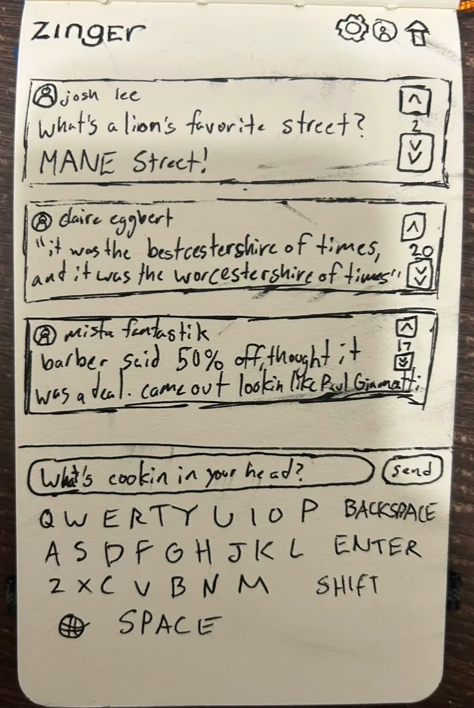

# Zinger

[My Notes](notes.md)

Zinger is an app for sharing, voting on, and celebrating good quips, jokes, and one-liners.

## 🚀 Specification Deliverable

For this deliverable I did the following. I checked the box `[x]` and added a description for things I completed.

- [x] Proper use of Markdown
- [x] A concise and compelling elevator pitch
- [x] Description of key features
- [x] Description of how you will use each technology
- [x] One or more rough sketches of your application. Images must be embedded in this file using Markdown image references.

### Elevator pitch

Have you ever whipped up an absolute knee-slapper of a joke, only to have no one around you to hear it? Now, instead of wilting in silence, you can post them on Zinger! Zinger lets you share jokes, one-liners, rap bars, and anything else to get the crowd roaring that comes in at 500 characters or less. Other Zinger users will vote on the app, +1 points per like and -2 points per dislike, to crown the day's best and worst zingers.

### Design

This mockup shows the main interface that users will engage with when using the Zinger app. It will primarily be a mobile application.

### Key features

- Users will be able to log in to an account securely.
- Accounts will be connected to a username and a history of all the user's posts.
- Users can create and submit posts to the Zinger feed.
- Posts will be able to be viewed in an infinite-scroll format.
- Users will be able to vote on other users' posted "zingers" (jokes).
- User data will be saved to a database upon closing the app.
- Administrators will be able to remove jokes deemed inappropriate.

### Technologies

I am going to use the required technologies in the following ways.

- **HTML** - HTML will be utilized for four main interfaces. A login page, a settings page, a page for viewing your "zingers", and the main interface, where zingers can be browsed and voted on.
- **CSS** - CSS will be utilized to ensure the content is centered and styled consistently across a number of devices and displays, as well as assisting with the engagement experience of the app.
- **React** - React will be utilized for the dynamic components of the app, such as loading user content, allowing user logins, allowing user creation and submission of "zingers", and allowing voting.
- **Service** - The Service represents endpoints for logins, votes, updating account profiles, submitting "zingers", submitting votes, retrieving account profiles, retrieving "zingers", and retrieving votes.
- **DB/Login** - The Database will store credentials and account info, in addition to all the "zingers" and their respective votes on the platform. Users must be logged in to participate in the Zinger platform.
- **WebSocket** - The WebSocket will facilitate the transmission of data relevant to the app, to synchronize data with the server and all clients.

## 🚀 AWS deliverable

For this deliverable I did the following. I checked the box `[x]` and added a description for things I completed.

- [ ] **Server deployed and accessible with custom domain name** - [My server link](https://yourdomainnamehere.click).

## 🚀 HTML deliverable

For this deliverable I did the following. I checked the box `[x]` and added a description for things I completed.

- [ ] **HTML pages** - I did not complete this part of the deliverable.
- [ ] **Proper HTML element usage** - I did not complete this part of the deliverable.
- [ ] **Links** - I did not complete this part of the deliverable.
- [ ] **Text** - I did not complete this part of the deliverable.
- [ ] **3rd party API placeholder** - I did not complete this part of the deliverable.
- [ ] **Images** - I did not complete this part of the deliverable.
- [ ] **Login placeholder** - I did not complete this part of the deliverable.
- [ ] **DB data placeholder** - I did not complete this part of the deliverable.
- [ ] **WebSocket placeholder** - I did not complete this part of the deliverable.

## 🚀 CSS deliverable

For this deliverable I did the following. I checked the box `[x]` and added a description for things I completed.

- [ ] **Header, footer, and main content body** - I did not complete this part of the deliverable.
- [ ] **Navigation elements** - I did not complete this part of the deliverable.
- [ ] **Responsive to window resizing** - I did not complete this part of the deliverable.
- [ ] **Application elements** - I did not complete this part of the deliverable.
- [ ] **Application text content** - I did not complete this part of the deliverable.
- [ ] **Application images** - I did not complete this part of the deliverable.

## 🚀 React part 1: Routing deliverable

For this deliverable I did the following. I checked the box `[x]` and added a description for things I completed.

- [ ] **Bundled using Vite** - I did not complete this part of the deliverable.
- [ ] **Components** - I did not complete this part of the deliverable.
- [ ] **Router** - I did not complete this part of the deliverable.

## 🚀 React part 2: Reactivity deliverable

For this deliverable I did the following. I checked the box `[x]` and added a description for things I completed.

- [ ] **All functionality implemented or mocked out** - I did not complete this part of the deliverable.
- [ ] **Hooks** - I did not complete this part of the deliverable.

## 🚀 Service deliverable

For this deliverable I did the following. I checked the box `[x]` and added a description for things I completed.

- [ ] **Node.js/Express HTTP service** - I did not complete this part of the deliverable.
- [ ] **Static middleware for frontend** - I did not complete this part of the deliverable.
- [ ] **Calls to third party endpoints** - I did not complete this part of the deliverable.
- [ ] **Backend service endpoints** - I did not complete this part of the deliverable.
- [ ] **Frontend calls service endpoints** - I did not complete this part of the deliverable.
- [ ] **Supports registration, login, logout, and restricted endpoint** - I did not complete this part of the deliverable.

## 🚀 DB deliverable

For this deliverable I did the following. I checked the box `[x]` and added a description for things I completed.

- [ ] **Stores data in MongoDB** - I did not complete this part of the deliverable.
- [ ] **Stores credentials in MongoDB** - I did not complete this part of the deliverable.

## 🚀 WebSocket deliverable

For this deliverable I did the following. I checked the box `[x]` and added a description for things I completed.

- [ ] **Backend listens for WebSocket connection** - I did not complete this part of the deliverable.
- [ ] **Frontend makes WebSocket connection** - I did not complete this part of the deliverable.
- [ ] **Data sent over WebSocket connection** - I did not complete this part of the deliverable.
- [ ] **WebSocket data displayed** - I did not complete this part of the deliverable.
- [ ] **Application is fully functional** - I did not complete this part of the deliverable.
